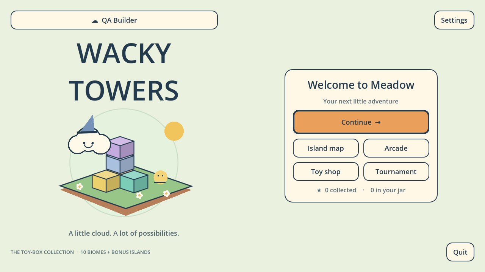

# Wacky Towers

A Godot 4.7.2 3D falling-block puzzle game about building on small floating
islands. Move and rotate voxel pieces, inspect their landing ghost, clear layers
and complete island objectives. The production game starts at
`src/app/main.tscn`; the earlier first-playable remains under `prototypes/`.

This is a playable development build. The authored game is larger than the
implemented subset: unsupported level requirements are recorded and blocked
from ordinary progression rather than silently substituted. See the
[build report](docs/release/BUILD_REPORT.md) before treating this as a release.



## Run from source

1. Install the **standard Godot 4.7.2 editor** for your platform; .NET is not
   required. Install its matching export templates if building executables.
2. Clone this repository and open `project.godot` in Godot. Allow the first
   asset import to finish.
3. Press **F6** with `src/app/main.tscn` open, or **F5** to run the project.
   Create a local profile and choose a Meadow island.

On Linux/macOS with Bash, the helper accepts a `GODOT` executable override or
finds `godot`/`godot4` on PATH:

```bash
GODOT=/path/to/godot tools/dev/run.sh
```

The engine downloaded for this build is also discovered automatically from
`../tools/bin/godot`. That sibling location is an environment convenience and
is not a dependency of the repository. On Windows, open the project through
the Godot project manager or run `Godot.exe --path .` in the repository.

Saves use Godot's `user://` directory, with four independent local profiles.
An ordinary source checkout does not include a player's saves.

## Controls

| Action | Keyboard / mouse |
|---|---|
| Move across the floor | WASD or arrow keys, relative to the camera |
| Turn piece | Q / E |
| Flip piece | R / F |
| Roll piece | T / G |
| Drop to the ghost | Space |
| Soft drop | Hold Shift |
| Hold piece, when enabled | H |
| Character skill | X |
| Selected potion | V |
| Rotate camera by one of twelve snaps | Z / C |
| Free camera orbit | Drag with right or middle mouse button |
| Pause / resume / back | Escape |
| Discover a visible secret gem | Left click / touch the gem |

Touch controls use the same actions. The layout adapts between portrait and
landscape. Gamepad mappings include left stick/D-pad movement, A drop,
B soft drop, shoulder-button Turn, X/Y Flip, Back hold and Start pause.
The options screen offers input rebinding and presentation/audio preferences.
Hardware controller and phone validation remain open release work.

## Available systems

- Deterministic 60 Hz board simulation, all 67 source shapes and 24 rotations,
  wall kicks, hold, landing ghosts, scoring and star objectives.
- Approved Meadow campaign implementation and a ten-biome content catalog.
  Campaign stars, unlock gates and local progress are stored per profile.
- Arcade and practice tournament sessions, bot rivals, character skills,
  potions and a transactional local shop.
- ENet LAN host/join sessions with authoritative simulation, lobby/ready flow,
  pause/resume and reconnect transport. This is direct LAN play; no matchmaking
  service is included.
- Original floating-island geometry and mascot placeholders, shared bevelled
  block mesh, colour/pattern preferences, reduced motion and twelve camera
  views.
- Eleven original synthesized sound cues and ten original biome music loops.

The exact implemented rule IDs and missing requirements for each level are in
[implementation_coverage.json](assets/data/campaign/implementation_coverage.json).
Boss encounters, some puzzle arrival modes and several later-biome atoms remain
incomplete. Final painted assets, skits, mobile release work and tuning are not
claimed complete.

## Build and verify

`export_presets.cfg` provides Linux, Windows and Web presets. Use **Project →
Export** after installing Godot's matching 4.7.2 templates, or:

```bash
godot --headless --path . --export-release Linux builds/linux/WackyTowers.x86_64
godot --headless --path . --export-release Windows builds/windows/WackyTowers.exe
godot --headless --path . --export-release Web builds/web/index.html
```

Create each destination directory first. Release exports exclude development
staging, tests, design documents, production evidence and studio tooling.
Platform-specific export and launch results are recorded in the build report;
a preset alone is not evidence that its platform works.

The retained GdUnit suites run through the repository helper:

```bash
tools/ci/test.sh res://tests/unit all-unit
python tools/qa/verify_lan.py --help
python tools/qa/verify_main_lan.py --help
```

Tests are grouped by subsystem. Their reports and GUI captures complement one
another: source validity, deterministic rules and visual behaviour are separate
checks. A dedicated presentation probe can be launched with
`godot --path . res://src/view/wt_stage_demo.tscn`; its twelve-block fixture is
for rendering inspection. `wt_shape_gallery.tscn` displays all 67 silhouettes
with one MultiMesh. Reproduce the original WAV assets with:

```bash
python tools/asset-pipeline/generate_audio.py
```

## Design, architecture and evidence

- [As-built game architecture](docs/architecture/as-built-game.md)
- [Design reconciliation and remaining production work](design/implementation/design-reconciliation.md)
- [Build report and platform verification](docs/release/BUILD_REPORT.md)
- [Approved Meadow specification](design/levels/meadow.md)
- [Game design documents](design/gdd/)
- [Architecture decisions](docs/architecture/)
- [Runtime screenshots and logs](production/qa/evidence/build-2026-10-10/)
- [Development test fix report](production/qa/test-fix-report-2026-10-10.md)

## Attribution

This game repository began with **Claude Code Game Studios** by **Donchitos**.
Its studio agents, skills and workflow documentation remain available, with the
original [MIT license](LICENSE) and [workflow guide](docs/WORKFLOW-GUIDE.md).

Development also used **Godot Game Dev Studio**, assembled and curated by
**Powehi**, including its Godot and game-development skills. The vendored
plugin's [notice](tools/vendor/godot-game-dev-studio/NOTICE.md) and
[license](tools/vendor/godot-game-dev-studio/LICENSE) retain its upstream credits.
The tooling is excluded from game exports. Third-party addon licenses remain
with their respective addons. Godot Engine is developed by the Godot
contributors and is licensed under MIT.

New procedural island/mascot geometry and synthesized audio are original to
this implementation. The synthesis source and
[audio provenance](assets/audio/README.md) are retained. Final per-level music
tracks referenced by the design were not supplied for this build.
