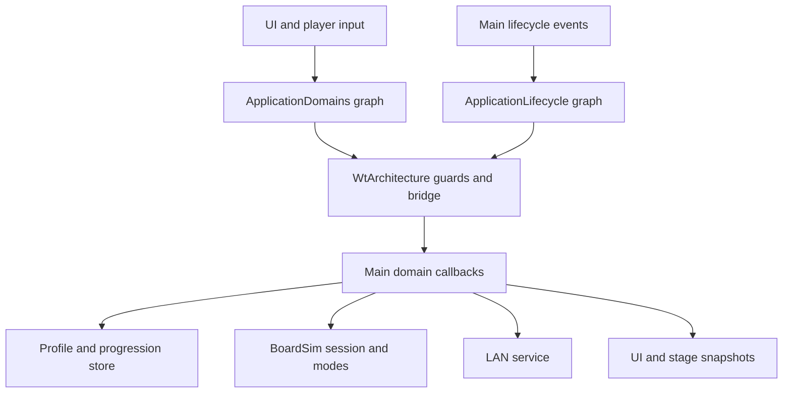

# ADR-0019: Executable Orchestrator application architecture

**Status:** implemented desktop runtime; Android device acceptance outstanding.
**Engine/addon:** Godot 4.7.2 and official Orchestrator 2.5 stable.

The application has several independent domains: profiles, campaign progression,
sessions, alternate modes, LAN parties, preferences, and presentation. An editable
architecture graph makes their routing and lifecycle boundaries visible while
keeping the fixed-tick gameplay model independent of visual scripting.

`src/app/architecture.torch` is an actual Orchestrator OScript resource in its
native text format. `ApplicationDomains` validates requests before switching on
their intent and invoking one of seven typed bridge methods. Unknown requests
reach a rejection branch. `ApplicationLifecycle` selects explicit states for
boot, profile, map, intro, countdown, play, pause, result, and party events.

The graph determines the executed branch. `WtArchitecture` checks actual Main
session/profile/party state before execution; it does not maintain a second
simulation. Playing input is rejected while paused, without a session, or after
results. Puzzle controls are unavailable in LAN, progression actions require a
profile, and starting a party requires host authority. Main's domain methods
retain their detailed content, save, and network validation.

Lifecycle transitions produce a revisioned snapshot, bounded history, domain
dispatch counts, and rejection counts. Save commits increment a transaction
revision without replacing the current session state. These snapshots are
application diagnostics and do not enter deterministic board hashes or network
command frames.

| Contract | Purpose |
| --- | --- |
| `setup(host: Node)` | Instantiates the native OScript graph and records boot. |
| `dispatch(intent: StringName, data: Dictionary)` | Routes an application action through graph guards and domain branches. |
| `lifecycle(event: StringName, data: Dictionary)` | Executes the lifecycle graph and records its selected state. |
| `snapshot() -> Dictionary` | Returns an independent diagnostic snapshot. |
| `state_changed`, `intent_dispatched`, `intent_rejected` | Exposes state changes and routing outcomes without coupling gameplay to the graph. |

The source topology generator is `tools/orchestrator/build_architecture.py`.
Editing the graph in Godot is supported. Regenerating it replaces graph edits,
so update the generator deliberately when changing the initial architecture.
The official text format and pin conventions were checked against the upstream
[integration fixtures](https://github.com/CraterCrash/godot-orchestrator/tree/2.5/tests/scenes/features).

Five real native-graph regression tests passed on Godot 4.7.2, with zero errors,
failures, or orphan nodes. They execute all seven domains, reject invalid/stale
actions before application callbacks, test lifecycle states and save behavior,
cover new mode/inventory intents, and verify bounded independent snapshots.
Evidence is retained in `reports/architecture-native.log` and
`production/qa/evidence/build-2026-10-10/orchestrator/`.

The official [compatibility table](https://github.com/CraterCrash/godot-orchestrator)
maps Godot 4.7 to Orchestrator 2.5. The
[pinned release](https://github.com/CraterCrash/godot-orchestrator/releases/tag/v2.5.stable)
is downloaded and hash-verified by `tools/setup/install_orchestrator.py`.
Linux and Windows native execution, Web extensions support, and Android ARM64
packaging require their corresponding libraries. The official Android ARM64
library has 4 KiB ELF alignment; Android 16 KiB device compatibility and on-device
execution remain acceptance work. This amends ADR-0010's device-first graph gate:
the implemented desktop architecture is executable, while mobile acceptance is
recorded separately and is not inferred from a passing desktop test or APK export.
