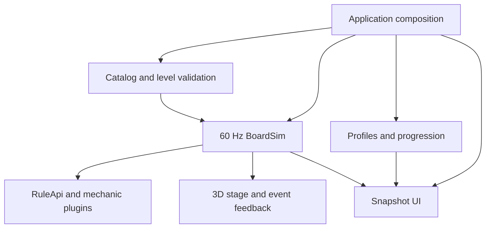

# Wacky Towers: as-built game

> Reverse-documented from the working implementation in `src/` on 2026-10-10,
> based on checkout `28ebb1e` plus uncommitted build changes. This records what
> the code does; the approved design remains the requirement source.

Updated 2026-10-10. This document describes the production code rather than the
frozen first-playable prototype. The approved specifications remain in
`design/gdd/`, `design/levels/` and ADRs 0001–0017. Content-specific omissions are
recorded in `assets/data/campaign/implementation_coverage.json`.

## Runtime composition

`project.godot` starts `src/app/main.tscn`. Its GDScript composition root loads
the trusted catalog, four-profile save store, presentation and UI. Gameplay
runs through `BoardSim.step()` at 60 Hz. Pausing stops simulation stepping;
star times and survival goals use simulation time.

| Responsibility | Production owner |
|---|---|
| Application screens, play/pause/results and input routing | `src/app/main.gd` |
| Board coordinates, occupancy, content, status and deltas | `src/core/board/board_state.gd` |
| Fixed-tick commands, movement, falling, locking, resolving and result | `src/core/sim/board_sim.gd` |
| Collision, rotation and ordered wall kicks | `src/core/sim/movement.gd`, `kick_table.gd` |
| Rule hooks, priorities, modifiers and buffered writes | `src/core/rules/`, `src/mechanics/` |
| Catalog, bounded level loading and semantic validation | `src/data/wt_content.gd`, `level_loader.gd`, `level_validator.gd` |
| Stars, campaign gates and mode selection | `src/core/sim/star_rater.gd`, `src/game/progression/`, `src/game/modes/` |
| Four profiles, settings, wallet, inventory and transactional purchases | `src/save/wt_profile_store.gd`, `file_save_io.gd` |
| Character skills and potions | `src/game/abilities/wt_abilities.gd` |
| ENet lobby, peer commands and authoritative round transport | `src/net/lan_session.gd` |
| Responsive screens and touch controls | `src/ui/game_ui.gd` |
| Read-only 3D stage, camera and effects | `src/view/wt_stage.gd` |
| Original music and pooled sound cues | `src/view/fx/wt_audio.gd` |

## Data and extension seams

Official levels live beside their scene resources under
`src/levels/<biome>/<level_id>/`. The explicit campaign catalog lists the
ten-biome order and level paths. JSON defines boards, masks, starting contents,
piece pools, goals, star thresholds and mechanic parameters. The loader keeps
unknown or unsupported authoring intent in metadata rather than silently
calling a different mechanic the same feature.

Scalar simulation knobs use integer milli-units. Shape offsets use
`Array[Vector3i]`; there is no `PackedVector3iArray` type. `ShapeDef` supplies
all 24 orientations; `ActivePiece` owns the current pivot/orientation and hue.
Views use the same hue as the locked board, including rolled colour modes.

Mechanics use `RuleApi` and registry IDs rather than importing the simulation
or changing scene nodes. Buffered board writes occur at documented hook points.
Presentation consumes events and state getters; it does not decide clears,
scores, damage or success.

## Presentation and source assets

`WtStage.setup(sim, biome, prefs)` binds an existing simulation. The root adds
the stage to the tree before setup, calls `set_goal(level.goal)` for objective
geometry, then reserves the HUD's normalized viewport rectangle with
`set_board_area(rect)`. Each tick calls `sync(events)`.

Locked blocks, active pieces, landing ghosts, landing marks and confetti use
MultiMeshes. Block geometry comes from the repository's
`blk_candy_toy_cube.res`, extracted from its bevelled GLB. Shape-bank offsets
preserve each silhouette. The existing Meadow palette supplies family colours;
Candy's flavour palette uses pink/violet/mint for hue IDs 1/2/3. Ten authored
palette motifs and an optional stronger contrast back up colour; foreground cubes can dither or cut
away above the landing ghost. Neither preference changes collision.

The floating islands, soil strata, roots/crystals, trees, windmill, coral,
lollipops, gears, cloud wizard and helper are original procedural geometry
authored in `wt_stage.gd`. They use primitive meshes and solid materials.
They are production placeholders for the final painted biome sets and mascot
models; they are not claimed to be the external models discussed in the asset
list. Biome differences currently come from palette, strata and prop selection.

The orthographic camera has twelve 30-degree snaps and free right/middle mouse
orbit, settling to the nearest snap on release. `get_move_vector()` maps
screen directions; `rotation_for()` maps Turn/Flip/Roll to world axes and
signs. Grid guides follow the two far walls. The root owns touch and gamepad
commands and passes camera intents to this view.

Mechanic events drive a separate pooled marker layer for mushroom warnings,
sprout buds and mascot suggestions. Fog changes locked-block coverage while
the active piece and ghost remain visible. Discoverable gems use original
geometry with an isolated click collider; the view emits `secret_tapped(id)`
and the application submits the corresponding tap command.

`predict(command)` is a LAN client presentation seam. It changes a duplicate
`ActivePiece`, validates it against the currently known board with `Movement`,
and renders the copy. Authoritative `sync()` discards the copy. It never
queues a gameplay command or mutates the simulation's piece or board.

## Audio

`tools/asset-pipeline/generate_audio.py` reproducibly generates eleven cues and
ten four-bar biome loops as mono PCM16 WAV at 22.05 kHz. All oscillators, noise,
notes and envelopes are authored here. No recordings, external compositions
or sample packs are used. The loops are playable defaults; the user's final
per-level tracks have not been supplied in this environment.

`WtAudio` keeps eight reusable effect players and one looping music player.
Master, music and effect levels are independent preferences. Clears, locks,
rotations, warnings and outcomes accompany visible feedback. Reduced motion
disables bobbing, ambient rotation and celebratory bursts.

## Verification record

Presentation has been launched in Godot 4.7.2 on a real Xvfb display with Mesa
llvmpipe. `production/qa/evidence/build-2026-10-10/stage-landscape.png` shows
the GLB-derived locked and active cubes, landing stencil and original mascots.
Its adjacent `.godot.log` records the Compatibility renderer and no script or
shader errors. Portrait, title and all-shape gallery screenshots are retained
in the same folder. The gallery renders all 67 shapes / 395 cubes in one
MultiMesh; the telegraph probe exercises fog and marker presentation.

`src/view/wt_stage_demo.tscn` is a reproducible presentation probe. It uses a
real BoardSim and a twelve-block fixture; its fixture is not campaign evidence.
Z/C rotate the camera, Space drops the piece and right drag orbits.
`--biome=<id>` selects another visual biome. Release readiness, device frame
times, Android/iOS behaviour and actual LAN latency need their own evidence;
software-rendered desktop images establish appearance and loading only.
